# Writing and Presentation Test Week 1
## **Back End**
### **Web Server & RESTful API**
- Web server memiliki 2 komponen penting yaitu Hardware dan Software.
- Web server yaitu tempat untuk coding Backend ataupun Frontend.
- Contoh web server yaitu seperti Netlify yaitu untuk Frontend.

monolith itu artinya semuanya jadi satu front end back end dll nya.

- REST (Representational State Transfer) punya beberapa rules yaitu :
1. Uniform interface
2. Client-server
3. stateless
4. cacheable
5. Layered system
6. code on demand (optional)
Kalau rule ini diterapkan semuanya namanya RESTful API.

- HTTP memiliki macam2 method yaitu :
1. GET
2. POST
3. DELETE
4. PUT
5. PATCH (partial)

ini tabel penamaannya dibawah :

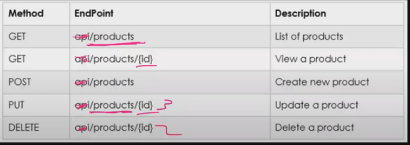

- Status Code :
1. 2xx sukses
2. 3xx redirect
3. 4xx client error
4. 5xx server error

### **Intro Node JS**
- Tools yang digunakan yaitu :
1. Visual Studio Code (code editor)
2. Browser latest version (Chrome, mozilla, opera, dll)
3. Command Line Iinterface (mac / linux : terminal, windows : cmd)
4. Node JS - https://nodejs.org/en

- Node JS adalah Javascript runtime yang dibangun diatas Chrome V8 Javascript Engine.
- Runtime adalah tempat untuk menjalankan coding kita.
- yang membuat javascript berjalan di browser yaitu :
1. Manipulasi DOM
2. EventListener
3. Interaksi
4. HTTP Request

### **Ryan Dahl**

- Software dev di Joyent
- 2009 membuat node js
- ingin membuat web server tapi menggunakan event loop
- sudah mencoba dengan C, Lua dan Haskell

- Fitur Utama :
1. File System
2. Http dan Https
3. REPL (read, eval, print, loop)
4. console

- Javascript menggunakan konsep single thread yang artinya punya satu tumpukan panggilan yang digunakan untuk menjalankan program.
- Perlu Memahami pemrograman JS agar mudah memahami node js seperti :
1. Arrow function expression
2. Asynchronous
3. JSON

1. **Arrow function expression**
Arrow expression merupakan fitur terbaru dari javascript, yaitu mempermudah membuat sintaks function menggunakan “=>” 
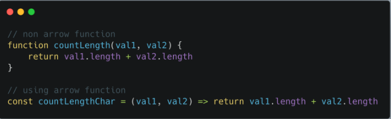

2. **Asynchronous**
Asynchronous merupakan konsep yang paling penting dari javascript. Pada dasarnya, javascript mengeksekusi code secara single thread dan berurutan baris per baris yang disebut dengan synchronous. Sedangkan asynchronous memungkinkan mengeksekusi code tanpa berurutan dengan cara “skip” code dan melanjutkan eksekusi code selanjutnya. Konsep ini menungkinkan code kita tidak terjadi blocking dan lebih efisien.
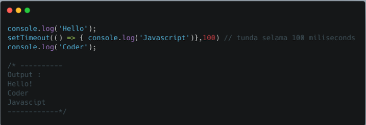

3. **JSON**
SON atau Javascript Object Notation merupakan format yang digunakan untuk menyimpan dan mengirim data menggunakan konsep object di javascript. JSON dapat digunakan di hampir semua bahasa pemrograman sehingga sangat cocok untuk dipelajari
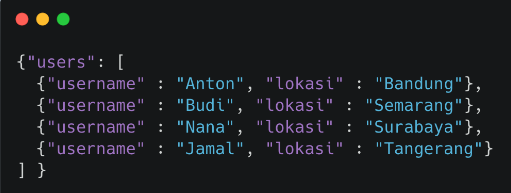

- Console 
console digunakan sebagai debug atau mencetak kode secara interface.
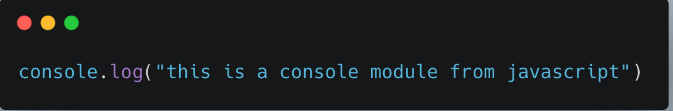

- Process
modules yang digunakan menampilkan dan mengontrol proses node js yang sedang dijalankan.
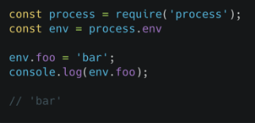

- OS 
module yang digunakan untuk menyediakan informasi yang berhubungan dengan sistem komputer yang dipakai user.
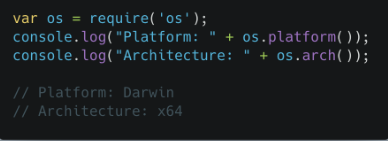

- Errors
modules yang digunakan untuk menghandle error dan lebih informatif.
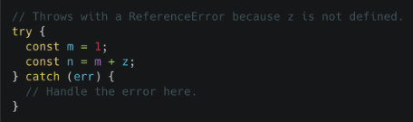

### **Membuat Web Server Dengan Node JS**
Node.js memiliki built-in modul yang disebut HTTP, built-in modul ini memungkinkan Node JS mentransfer data melalui Hyper Text Transfer Protocol (HTTP).Modul HTTP dapat membuat server HTTP yang mendengarkan port server dan memberikan respons kembali ke klien. Node JS Web Server juga :
1. Untuk menggunakan modul HTTP, gunakan require()
2. Gunakan method createServer() untuk membuat server HTTP
3. Callback function yang digunakan pada method http.createServer(), akan dijalankan ketika seseorang mencoba mengakses komputer pada port 8080.
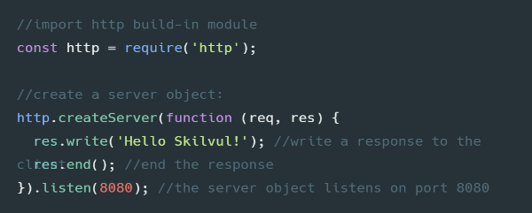

kalau menambahkan http header yaitu :
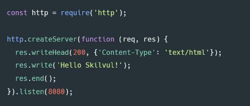

### **Express JS
- Express JS adalah aplikasi back end framework untuk node js dan open source.
- didesain untuk membangun aplikasi web dan APIS.
- Back End app adalah aplikasi yang berjalan di server-side yang bekerja memberikan informasi yang datanya sesuai request dari client atau browser. biasanya server-side app membuat REST API.
- Kelebihan dari framework ini terletak pada fitur caching, support dengan Google V8 Engine, JavaScript, serta didukung oleh komunitas dan skalabilitas aplikasi yang baik.
- RESTful API / REST API merupakan penerapan dari API (Application Programming Interface). 
- RESTful API punya komponen yang penting yaitu :
1. URL Design
2. HTTP Verbs
3. HTTP Response Code
4. Format Response

berikut contoh komponen nya :
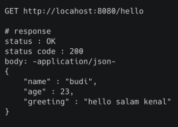

- Disini contoh basic sintaks Express JS :
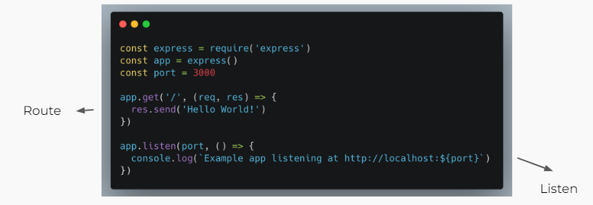

- Routes sebuah end point yang diapat kita akses menggunakan URL di website. Didalam routes kita perlu menentukan method API, alamat dan response apa saja yang akan dikeluarkan.
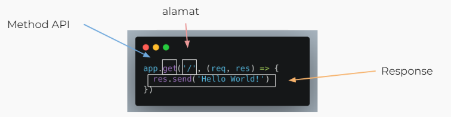

- kita juga dapat menggunakan method seperti post put patch delete seperti berikut :
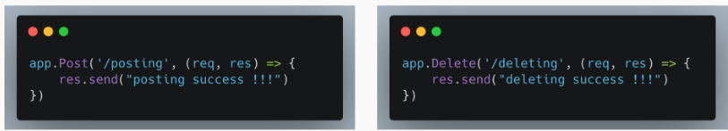

- Express juga ada Express Middleware yaitu fungsi yang memiliki akses ke object request (req, response atau res dan next). Fungsi next biasanya diberi nama variable next.

- Apa saja yang dapat dilakukan function middleware atau tugasnya :
1. Menjalankan kode apapun.
2. Memodifikasi Object Request dan Object Response.
3. Menghentikan request-response cycle.
4. Melanjutkan ke middleware function selanjutnya atau ke handler function dalam suatu request response cycle.

### **Design Database With MySQL**
- contoh kita ada kasus membuat online music player. Layanan ini menawarkan pencarian lagu, penyanyi, album yang bisa di dengarkan.Pengguna layanan ini bisa melakukan pencarian berdasarkan judul lagu, nama penyanyi, ataupun judul album.Pengguna juga bisa membuat berbagai macam personal playlist favorite untuk nantinya di dengarkan kembali.Agar user bisa menggunakan berbagai macam layanan dari Skilvul Music Player, user diwajibkan mendaftar dan login kedalam aplikasi.

- Menentukan Entity
1. Berdasarkan requirement yang ada kita bisa mulai untuk mengidentifikasi entity dalam database.
2. Beberapa kandidat yang paling sering menjadi sebuah entity : peoples, things, events, locations
3. Mari kita lihat kembali requirement yang ada, dan kita mulai list entity yang ada.
4. Berikut adalah kandidat yang bisa dijadikan enitity dalam database :
- User
- Singer
- Track
- Album
- Playlist

- User Entity
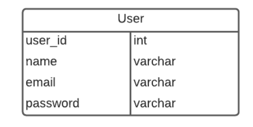

- Singer entity
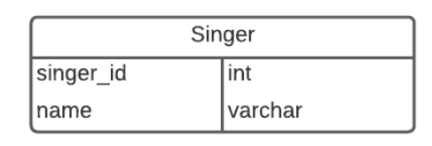

- Track Entity
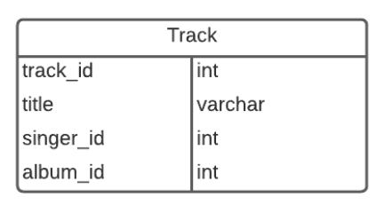

- Album Entity
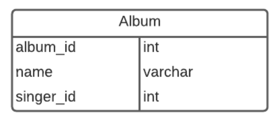

- Playlist Entity
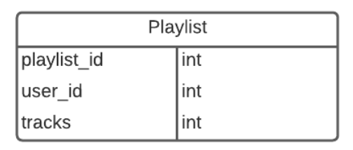

- Relasi Entity diatas yaitu :
1. 1 singer bisa punya banyak track atau 1 to M
2. 1 album bisa punya 1 atau lebih ( 1 to M)
3. 1 user bisa punya 0 atau lebih playlist (zero or more to many)
4. playlist dan track itu many to many

jadi keseluruhannya :
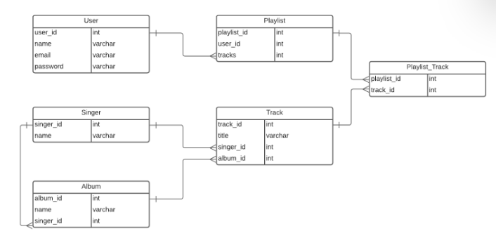

contoh membuat table nya : 
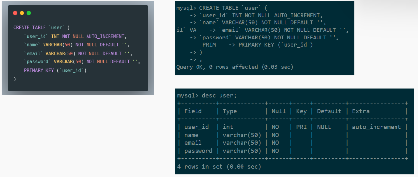

